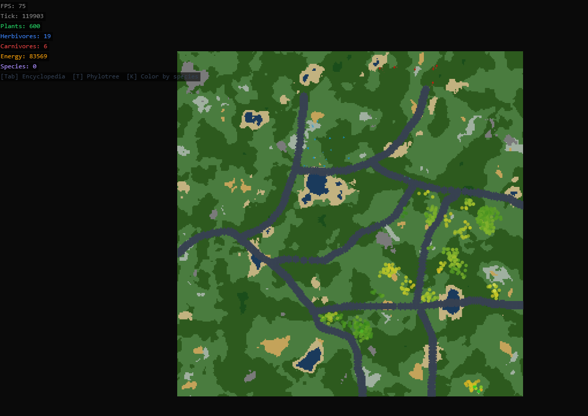
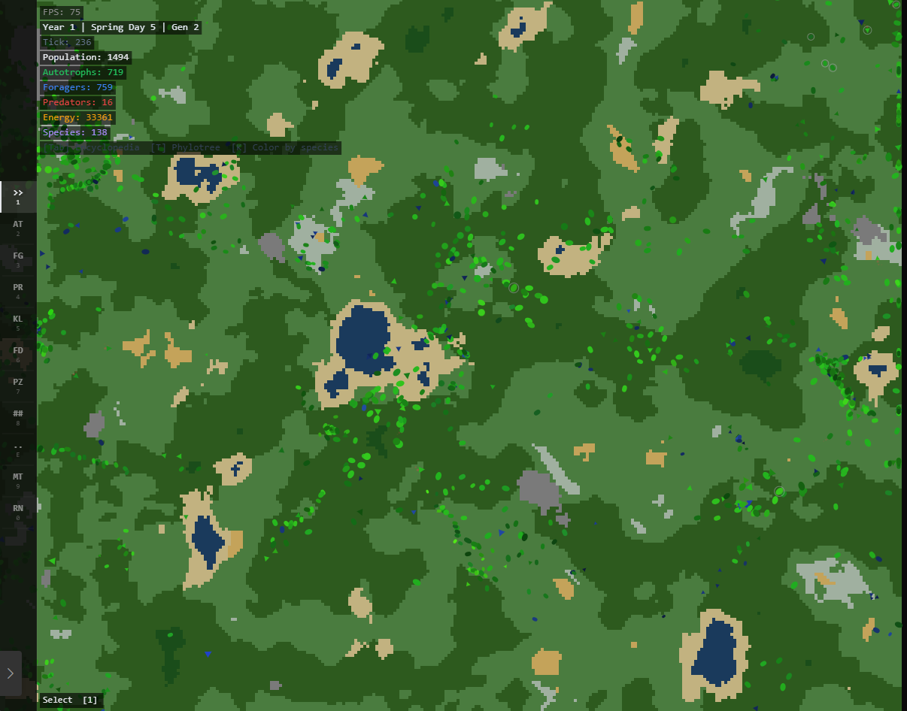

# Morphogen

Real-time procedural ecosystem simulation where creatures evolve through genuine natural selection. Start from two primordial organisms and watch species emerge, diverge, and adapt.


*Procedural terrain with 9 biomes, rivers, lakes, and plant colonies spreading across the landscape.*


*Year 1, Spring Day 5: 1,494 organisms across 138 species emerged from just 2 primordial cells. Autotrophs (green), Foragers (blue), and Predators (dark) coexist in a self-balancing ecosystem.*


## Why I Built This

Started because I was bored of every evolution simulator being fake. WorldBox, Spore, all of them. The creatures don't actually evolve, they just follow scripts someone wrote. I wanted to see if I could make something where the behavior isn't designed at all.

The early versions were crap. I had hardcoded plants, herbivores, carnivores. Basically the same thing everyone else does. It worked but it was predictable. You always knew what would happen because I'd already decided what everything was.

The version that actually got interesting was when I deleted all of that and made every organism the same thing. Just a blob with numbers. Some of those numbers control how much energy it gets from sunlight, others control how fast it moves. The trick is you can't max out both. If you're fast you can't photosynthesize well. That one tradeoff is what makes the whole thing work.

First time I ran it with two organisms and came back ten minutes later to find predators had evolved on their own. Nothing in the code says "hunt other organisms." It just happened because being aggressive toward smaller things turned out to be a viable survival strategy. That was sick.

The maths behind it is real. Lotka-Volterra for population dynamics, Perlin noise for terrain, Gaussian mutation on trait vectors. Its not a game pretending to be science. Its a simulation that happens to be fun to watch.
## What Makes This Different

Unlike WorldBox or similar god games, **nothing is scripted**. There are no predefined "plants" or "animals" — every organism has a 12-trait genome, and behavior emerges from evolutionary pressure:

- **Photosynthesis vs Speed** are antagonistic — you can't be good at both
- **Size vs Metabolism** trade-off forces specialization
- **Aggression vs Defense** creates predator-prey arms races
- Over generations, lineages naturally diverge into autotrophs (plant-like), foragers (herbivore-like), and predators (carnivore-like)

## Features

- **Procedural Terrain** — Fractal Brownian motion with 9 biomes, hydraulic erosion
- **Real Evolution** — 12-trait genome with Gaussian mutation and natural selection
- **Species Tracking** — Auto-generated Latin binomial names, phylogenetic tree visualization
- **God Tools** — Spawn, kill, feed, poison, draw walls, drop meteors, trigger rain
- **Natural Disasters** — Ice age, plague, flood, drought, solar flare
- **Time Control** — Pause, 1-50x speed, tick stepping
- **Seasons** — Spring/Summer boost growth, Winter increases metabolism
- **Species Encyclopedia** — Press Tab to browse all species with genome charts
- **Phylogenetic Tree** — Press T to view branching evolutionary history

## Controls

| Key | Action |
|-----|--------|
| Space | Pause / Unpause |
| +/- | Speed up / Slow down (1x to 50x) |
| . | Step one tick |
| 1-0 | Select tool (Select, Spawn variants, Kill, Feed, Poison, Wall, Meteor, Rain) |
| Right Click | Quick kill |
| Tab | Species Encyclopedia |
| T | Phylogenetic Tree |
| K | Toggle species color mode |
| I/G/O/D/S | Trigger disasters (Ice Age, Plague, Flood, Drought, Solar Flare) |
| Scroll | Zoom |
| Click + Drag | Pan camera |

## Tech Stack

- **Server:** Rust (Cargo workspace) — deterministic simulation engine
- **Client:** TypeScript + Vite + Canvas 2D — zero external dependencies
- **Terrain:** From-scratch Perlin noise implementation with octave layering
- **Ecosystem:** Agent-based simulation with energy conservation and Lotka-Volterra dynamics

## Running Locally

```bash
cd client
npm install
npm run dev
```

Open `http://localhost:5173` in your browser.

## The Science

The simulation is grounded in real mathematical models:

- **Lotka-Volterra equations** for predator-prey population dynamics
- **Darwinian natural selection** — inheritance with variation under resource scarcity
- **Fractal Brownian Motion** for terrain generation (same algorithm as No Man's Sky)
- **Conservation of energy** — closed thermodynamic system with trophic efficiency
- **Speciation** via genome divergence (euclidean distance threshold)

## License

MIT
